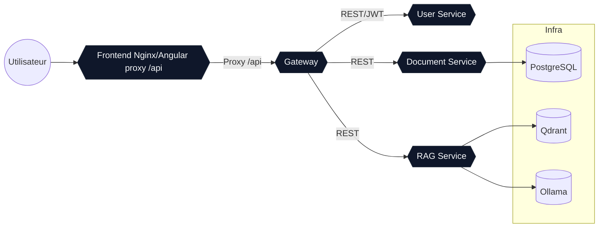

# AI Knowledge Workspace

Ensemble microservices complet (Gateway, RAG, Documents, Users) + frontend Angular pour interroger un LLM local (Ollama), exécuter du RAG avec Qdrant, gérer des documents et des utilisateurs. Ciblé MacBook Pro M1 (ARM64), full offline.

## Stack
- Java 21 / Spring Boot 3.3.4, Spring Security JWT, Spring Cloud 2023.0.x (Gateway), Spring AI
- RAG: Ollama (llama3/mistral/qwen), Qdrant vector DB
- Data: PostgreSQL (documents), JPA + MapStruct
- Frontend: Angular 18, Material-ready, JWT interceptor
- Tests: Testcontainers (PostgreSQL) prêts dans le POM
- Orchestration: Docker Compose (profils `dev`/`prod`/`gpu`), secrets Docker, volumes, réseaux privés
  
Note : la version la plus récente de Spring AI ne supporte que Spring Boot 3.3.x et Spring Cloud 2023.0.x

## Arborescence
- `frontend/` Angular 18 (Chat, Documents, Profil) + Dockerfile (Nginx)
- `backend/pom.xml` parent multi-modules
- `backend/gateway/` BFF Spring Cloud Gateway (JWT propagation, CORS)
- `backend/rag-service/` pipeline RAG (placeholder streaming, hooks Ollama/Qdrant)
- `backend/document-service/` gestion docs PostgreSQL + MapStruct
- `backend/user-service/` auth in-memory + issuance JWT
- `backend/*/entrypoint.sh` charge le secret JWT depuis Docker secret
- `backend/secrets/jwt_secret.example` exemple de secret

## Prérequis Mac M1
- Docker Desktop (BuildKit activé) + ~12GB RAM pour modèles
- Ollama installé (local) si usage hors Docker, sinon conteneur `ollama/ollama` ARM64
- JDK 21 + Maven 3.9 si build hors Docker
- Node 20 si build frontend hors Docker

## Démarrage rapide
```bash
# 1) secret JWT
cp docker/secrets/jwt_secret.example docker/secrets/jwt_secret

# 2) build & run (profil dev)
DOCKER_BUILDKIT=1 docker compose --profile dev up --build

# Frontend : http://localhost:4200
# Gateway : http://localhost:8080
# Qdrant : http://localhost:6333 (UI)
# Ollama : http://localhost:11434
```

### Profils
- `dev` : tout sauf GPU
- `prod` : idem sans ports DB exposés (adapter compose selon besoin)
- `gpu` : active `ollama`/`rag-service` pour usage GPU si dispo

### Auth par défaut
- `admin/admin123` (roles ADMIN,USER)
- `user/user123` (role USER)

## API (exemples)
- Auth: `POST /api/auth/login` -> `{ token, username }`
- Docs: `GET /api/documents`, `POST /api/documents {name,description}`
- RAG: `POST /api/rag/answer {query}` (renvoie `RagResponse`), streaming SSE `/api/rag/query`

## Build locaux (sans Docker)
```bash
mvn -pl gateway,rag-service,document-service,user-service -DskipTests package
cd frontend && npm install && npm run build
```

## Adaptations RAG/Vector
- Config Ollama: `rag-service/src/main/resources/application.yml` (`OLLAMA_BASE_URL`, `OLLAMA_MODEL`)
- Config Qdrant: `QDRANT_URL`, collection `knowledge-base`
- Implémentation actuelle du RAG est un placeholder ; brancher votre pipeline (Spring AI ou client Qdrant) dans `rag-service/src/main/java/com/ai/knowledge/rag/service/RagService.java`.
- `rag-service` utilise Spring AI (starter Ollama) sur Spring Boot 3.3.x.

## Qualité & extensions
- Hexa: séparer API/service/domain (ex: `document-service`)
- OpenAPI UIs exposées via springdoc (`/swagger-ui.html`)
- Logs JSON à ajouter via Logback JSON si besoin
- Tests d’intégration: ajouter des `@Testcontainers` pour PostgreSQL/Qdrant

## Nettoyage
```bash
docker compose down -v
```

## Diagramme des conteneurs (Docker Compose)


## Points de personnalisation
- Remplacer le secret JWT et durée (`user-service` -> `JwtService`)
- Ajouter persistance utilisateurs + rôles en DB
- Ajout upload binaire + pipeline chunking/embedding dans `document-service`
- Ajouter vérification GPU à `docker-compose.yml` (devices pour ollama)


## Tips

### Buildkit
BuildKit est le moteur de build moderne de Docker. Il parallélise les étapes, met en cache plus finement (y compris sur plusieurs architectures), supporte les secrets et mounts temporaires pendant le build, et produit des images plus rapidement et de façon reproductible par rapport à l’ancien backend docker build. On l’active via DOCKER_BUILDKIT=1 ou dans la config Docker.

### Test

Login depuis le host, en passant par la gateway :
```bash
curl -v -H 'Content-Type: application/json' -d '{"username":"admin","password":"admin123"}' http://localhost:8080/api/auth/login
```

Login depuis le réseau interne docker compose : 
```bash
docker compose exec toolbox curl -v -H 'Content-Type: application/json' -d '{"username":"admin","password":"admin123"}' http://user-service:8080/api/auth/login
```

Créer un document :
```bash
# 1. Obtenir un token
TOKEN=$(curl -s -H "Content-Type: application/json" \
  -d '{"username":"admin","password":"admin123"}' \
  http://localhost:8080/api/auth/login | jq -r .token)

# 2. Créer un document
curl -v -H "Authorization: Bearer $TOKEN" -H "Content-Type: application/json" \
  -d '{"name":"Mon doc","description":"Test"}' \
  http://localhost:8080/api/documents
```
