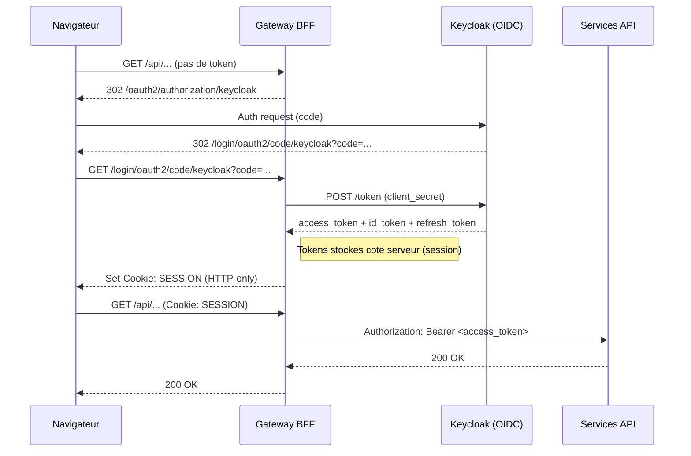
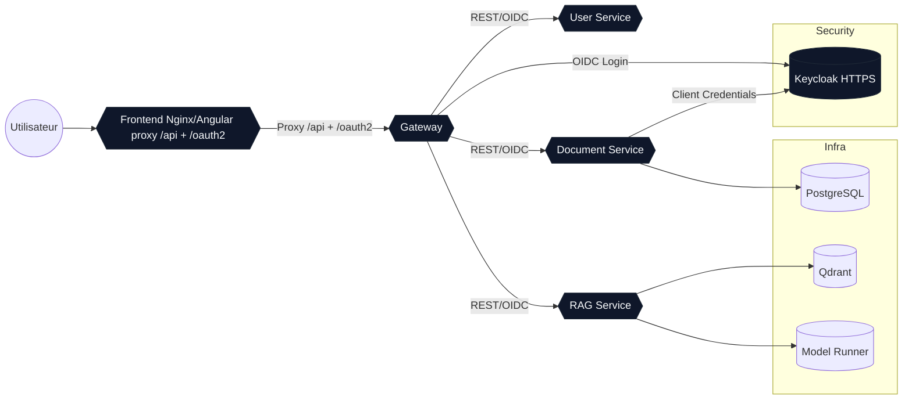

# AI Knowledge Workspace

Ensemble microservices complet (Gateway, RAG, Documents, Users) + frontend Angular pour interroger un LLM local via Docker Model Runner, exécuter du RAG avec Qdrant, gérer des documents et des utilisateurs. Ciblé MacBook Pro M1 (ARM64), full offline.

## Stack
- Java 21 / Spring Boot 3.3.4, Spring Security OIDC, Spring Cloud 2023.0.x (Gateway), Spring AI (OpenAI starter)
- RAG: Docker Model Runner (chat: qwen2.5, embeddings: mxbai-embed-large), Qdrant vector DB
- Data: PostgreSQL (documents), JPA + MapStruct
- Frontend: Angular 18, Material-ready, BFF OIDC (session)
- Tests: Testcontainers (PostgreSQL) prêts dans le POM
- Orchestration: Docker Compose (profils `dev`/`prod`), secrets Docker, volumes, réseaux privés
  
Note : la version la plus récente de Spring AI ne supporte que Spring Boot 3.3.x et Spring Cloud 2023.0.x

## Arborescence
- `frontend/` Angular 18 (Chat, Documents, Profil) + Dockerfile (Nginx)
- `backend/pom.xml` parent multi-modules
- `backend/gateway/` BFF Spring Cloud Gateway (OIDC login, TokenRelay, CORS)
- `backend/rag-service/` pipeline RAG (chunking, embeddings, Qdrant)
- `backend/document-service/` gestion docs PostgreSQL + MapStruct
- `backend/user-service/` profil utilisateur (`/api/users/me`)

## Prérequis Mac M1
- Docker Desktop (BuildKit activé) + ~12GB RAM pour modèles
- Docker Desktop > Settings > AI > Docker Model Runner: Enable Docker Model Runner + Enable host-side TCP support
- Modèles Docker pré-téléchargés via `docker model pull` (qwen2.5 + mxbai-embed-large)
- JDK 21 + Maven 3.9 si build hors Docker
- Node 20 si build frontend hors Docker

## Backend MLX (macOS Apple Silicon, optionnel)
Pour optimiser Docker Model Runner sur Mac M1/M2, installe MLX sur le host puis redémarre Model Runner.

```bash
brew install python@3.13 pipx
pipx ensurepath
# Fermez puis rouvrez votre terminal si besoin
pipx install mlx-lm
docker desktop disable model-runner
docker desktop enable model-runner
```

Vérifie l'installation :
```bash
docker model status
```
Tu dois voir `mlx: installed`.

## Démarrage rapide

Option 1
```bash
# 1) CA locale
make ca-root

# 2) env (optionnel, pour override)
make env

# 3) Ajout de keycloak.local dans /etc/hosts
make hosts-keycloak

# 4) pull models (chat + embeddings)
make pull-models

# 5) (optionnel) warmup du modèle chat
make run-models

# 6) build & run (profil dev)
make build up
```

Option 2
```bash
# 1) CA locale
make ca-root

# 2) Automatisation des actions
make all
```

Endpoints
```bash
# Frontend : http://localhost:4200
# Gateway : http://localhost:8080
# Keycloak : https://keycloak.local:8443
# Qdrant : http://localhost:6333 (UI)
# Model Runner : http://localhost:12434/v1
```

### HTTPS / CA locale
La CA locale est stockee dans `.certs/ca.crt`. `make ca-root` genere aussi `.certs/truststore.p12` (keytool requis). Pour l'importer selon ton OS, voir `docs/ca-import.md`.

#### Vérifier le TLS
```bash
# Vérifier la découverte OIDC avec la CA locale
curl --cacert .certs/ca.crt \
  https://keycloak.local:8443/realms/knowledge/.well-known/openid-configuration
```

```bash
# Vérifier le certificat présenté par Keycloak
echo | openssl s_client -connect keycloak.local:8443 -servername keycloak.local 2>/dev/null | openssl x509 -noout -subject -issuer
```

```bash
# Vérifier le truststore Java (PKCS12)
keytool -list -keystore .certs/truststore.p12 -storetype PKCS12 -storepass changeit
```

### Profils
- `dev` : tous les services pour le développement local
- `prod` : idem sans ports DB exposés (adapter compose selon besoin)

### Auth par défaut
- `admin/admin123` (roles ADMIN,USER)
- `user/user123` (role USER)
- Si tu es redirige vers "Update Profile" apres login, verifie que l'utilisateur a un email. Le realm fourni en a un par defaut, sinon edite l'utilisateur dans Keycloak.

## API (exemples)
- Docs: `GET /api/documents`, `POST /api/documents` (multipart: `file` PDF/EPUB/TXT ou `content`, `name`, `description`), `PUT /api/documents/{id}`, `DELETE /api/documents/{id}` (purge Qdrant)
- RAG: `POST /api/rag/answer {query}` (Model Runner via Spring AI, utilise le contexte des documents ingérés), streaming SSE `/api/rag/query`

## Build locaux (sans Docker)
```bash
mvn -pl gateway,rag-service,document-service,user-service -DskipTests package
cd frontend && npm install && npm run build
```

## Adaptations RAG/Vector
- Config Model Runner: `rag-service/src/main/resources/application.yml` (`OPENAI_BASE_URL` par défaut `http://host.docker.internal:12434`, `OPENAI_API_KEY`) + overrides via `.env` (voir `env.template`).
- Modèle de chat: `OPENAI_MODEL=ai/qwen2.5:latest` dans `docker-compose.yml` (le pull se fait avec `docker model pull qwen2.5`).
- Modèle d'embedding: `OPENAI_EMBEDDING_MODEL=ai/mxbai-embed-large:latest` (pull via `docker model pull mxbai-embed-large`).
- Chunking d'ingestion: propriétés `rag.ingest.*` (env `RAG_INGEST_*`) pour éviter les inputs trop longs lors des embeddings.
- Les documents envoyés avec un champ `content` sont transmis à `rag-service`, vectorisés puis stockés dans Qdrant.
- `rag-service` utilise Spring AI (starter OpenAI) sur Spring Boot 3.3.x.

## Qualité & extensions
- Hexa: séparer API/service/domain (ex: `document-service`)
- OpenAPI UIs exposées via springdoc (`/swagger-ui.html`)
- Logs JSON à ajouter via Logback JSON si besoin
- Tests d’intégration: ajouter des `@Testcontainers` pour PostgreSQL/Qdrant

## Architecture
Le projet est organise autour d'un **gateway BFF** qui sert d'entree unique pour le frontend et de micro-services specialises. Le navigateur ne manipule **aucun token** : l'authentification OIDC se fait entre le gateway et Keycloak, puis le gateway relaie les appels vers les services internes.

### Services (docker-compose)
- **frontend** : Angular + Nginx. Sert l'UI et reverse-proxy `/api`, `/oauth2`, `/login`, `/logout` vers le gateway. Aucun token stocke dans le navigateur.
- **gateway** : BFF Spring Cloud Gateway. Client OIDC principal (authorization code), maintient une session HTTP (cookies HTTP-only) et relaie l'access token vers les services via `TokenRelay`.
- **keycloak** : IdP OIDC en HTTPS (realm/clients/roles). Sert l'issuer `https://keycloak.local:8443/realms/knowledge`.
- **keycloak-certgen** : conteneur *one-shot* qui genere le cert serveur Keycloak dans `.certs/` a partir de la CA locale.
- **document-service** : CRUD documents + extraction de texte (PDF/EPUB/TXT). Persiste en PostgreSQL et declenche l'ingestion RAG.
- **rag-service** : pipeline RAG. Chunking + embeddings via Model Runner, stockage dans Qdrant, et endpoints de recherche/chat.
- **user-service** : service profil (`/api/users/me`), expose les claims utiles de l'utilisateur (resource server OIDC).
- **postgres** : persistence des documents et metadonnees.
- **qdrant** : base vectorielle (embeddings + metadonnees).
- **modelrunner** : LLM local (chat + embeddings) expose via API OpenAI-compatible.
- **toolbox** : utilitaire curl en reseau interne (dev/debug).

### OIDC dans ce projet (Authorization Code + BFF)
- **Type de flow** : authorization code **sans PKCE** (client confidentiel `gateway-bff` avec secret cote serveur).  
  PKCE n'est pas necessaire ici car le navigateur ne detient jamais le client secret. Si le frontend devait devenir un client public, PKCE serait a activer.
- **Etapes** :  
  1) Le frontend redirige vers `/oauth2/authorization/keycloak`.  
  2) Keycloak authentifie l'utilisateur et renvoie un code au gateway (`/login/oauth2/code/keycloak`).  
  3) Le gateway echange le code contre des tokens et ouvre une session HTTP server-side (cookies HTTP-only).  
  4) A chaque appel `/api/*`, le gateway attache l'`Authorization: Bearer` vers les services internes.
- **Validation** : chaque service est un *resource server* OIDC et valide les JWT via l'issuer HTTPS.  
  La CA locale est chargee via le truststore `.certs/truststore.p12`.
- **Logout** : le frontend appelle `/logout` et le gateway gere la fin de session OIDC.
- **Cookie de session** : le cookie (ex: `JSESSIONID`) ne contient qu'un identifiant de session.  
  Les tokens OIDC sont stockes cote serveur dans la session associee.

### Diagramme OIDC (tokens + cookies)


### Pourquoi `client_credentials` ?
L'ingestion RAG n'est **pas liee a un utilisateur interactif** : elle est declenchee en arriere-plan par `document-service`.  
Pour appliquer le **moindre privilege**, `document-service` utilise un client Keycloak dedie et le flux `client_credentials`, associe au role `ROLE_INGESTOR`.  
Ainsi, `rag-service` n'accepte l'ingestion que via ce role, et **aucun token utilisateur n'est reutilise**.

### Workflow d'ingestion des documents
1) **Upload** : `frontend` envoie le fichier ou le texte a `document-service` via le gateway.  
2) **Extraction** : `document-service` extrait le texte (PDF/EPUB/TXT), normalise les metadonnees et persiste en PostgreSQL.  
3) **Ingestion** : apres commit, `document-service` appelle `rag-service` (`POST /api/rag/index`) avec `{id, name, description, content}` en **client credentials**.  
4) **Indexation** : `rag-service` decoupe le contenu (parametres `rag.ingest.*`), calcule les embeddings via Model Runner et stocke dans Qdrant.

### Utilisation dans le chat
1) **Question** : `frontend` envoie la requete au `rag-service` via le gateway.  
2) **Embedding** : `rag-service` calcule l'embedding de la question via Model Runner.  
3) **Recherche** : similarite dans Qdrant pour retrouver les chunks pertinents.  
4) **Generation** : construction du prompt + appel au modele de chat (Model Runner).  
5) **Reponse** : resultat renvoye au frontend (JSON ou streaming SSE).

### Flux principaux
- **Chat** : frontend → gateway → rag-service → Model Runner → reponse RAG.
- **Documents** : frontend → gateway → document-service → (ingestion RAG asynchrone).
- **Profil** : frontend → gateway → user-service `/api/users/me`.

## Nettoyage
```bash
docker compose down -v
```

## Diagramme des conteneurs (Docker Compose)


## Points de personnalisation
- Configurer le realm/clients/roles OIDC (Keycloak)
- Ajouter persistance utilisateurs + rôles en DB
- Ajout upload binaire + pipeline chunking/embedding dans `document-service`


## Tips

### Buildkit
BuildKit est le moteur de build moderne de Docker. Il parallélise les étapes, met en cache plus finement (y compris sur plusieurs architectures), supporte les secrets et mounts temporaires pendant le build, et produit des images plus rapidement et de façon reproductible par rapport à l’ancien backend docker build. On l’active via DOCKER_BUILDKIT=1 ou dans la config Docker.

### Test

Login via UI :
- Ouvrir `http://localhost:4200/profil` puis cliquer sur “Connexion”.

Token via CLI (optionnel, nécessite d'activer Direct Access Grants sur le client `gateway-bff`) :
```bash
TOKEN=$(curl -s --cacert .certs/ca.crt \
  -X POST https://keycloak.local:8443/realms/knowledge/protocol/openid-connect/token \
  -H 'Content-Type: application/x-www-form-urlencoded' \
  -d 'client_id=gateway-bff' \
  -d 'client_secret=gateway-bff-secret' \
  -d 'grant_type=password' \
  -d 'username=admin' \
  -d 'password=admin123' | jq -r .access_token)
```

Créer un document texte (sera envoyé à rag-service pour ingestion) :
```bash
curl -s -H "Authorization: Bearer $TOKEN" \
  -F "name=Mon doc" \
  -F "description=Test" \
  -F "content=Ceci est un texte a utiliser comme contexte." \
  http://localhost:8080/api/documents | jq
```

Poser une question (le prompt inclura le contenu ingéré) :
```bash
curl -s -H "Authorization: Bearer $TOKEN" -H "Content-Type: application/json" \
  -d '{"query":"Que dit le document ?"}' \
  http://localhost:8080/api/rag/answer | jq
```

Uploader un fichier (PDF/EPUB/TXT) :
```bash
curl -s -H "Authorization: Bearer $TOKEN" \
  -F "file=@/path/to/doc.pdf" \
  -F "name=Mon document" \
  -F "description=Extrait" \
  http://localhost:8080/api/documents | jq
```

Limite par defaut des uploads de fichiers: 20MB (env `GATEWAY_MAX_IN_MEMORY_SIZE`, `DOC_MAX_FILE_SIZE`, `DOC_MAX_REQUEST_SIZE`).

### Utilisation UI
- Onglet “Documents” : saisissez Nom/Description, glissez/déposez un fichier texte, PDF ou EPUB (ou cliquez pour choisir), puis cliquez sur “Ajouter”. Les PDF/EPUB sont parsés côté document-service avant ingestion.
- Onglet “Chat” : posez une question, les réponses utilisent le contexte des documents ingérés.
