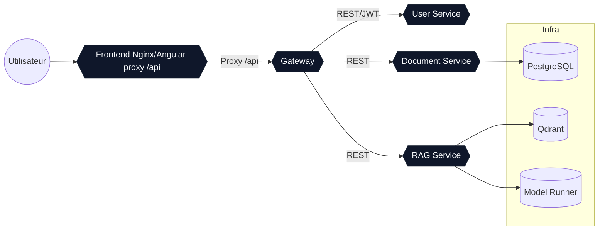

# AI Knowledge Workspace

Ensemble microservices complet (Gateway, RAG, Documents, Users) + frontend Angular pour interroger un LLM local via Docker Model Runner, exécuter du RAG avec Qdrant, gérer des documents et des utilisateurs. Ciblé MacBook Pro M1 (ARM64), full offline.

## Stack
- Java 21 / Spring Boot 3.3.4, Spring Security JWT, Spring Cloud 2023.0.x (Gateway), Spring AI (OpenAI starter)
- RAG: Docker Model Runner (chat: qwen2.5, embeddings: mxbai-embed-large), Qdrant vector DB
- Data: PostgreSQL (documents), JPA + MapStruct
- Frontend: Angular 18, Material-ready, JWT interceptor
- Tests: Testcontainers (PostgreSQL) prêts dans le POM
- Orchestration: Docker Compose (profils `dev`/`prod`), secrets Docker, volumes, réseaux privés
  
Note : la version la plus récente de Spring AI ne supporte que Spring Boot 3.3.x et Spring Cloud 2023.0.x

## Arborescence
- `frontend/` Angular 18 (Chat, Documents, Profil) + Dockerfile (Nginx)
- `backend/pom.xml` parent multi-modules
- `backend/gateway/` BFF Spring Cloud Gateway (JWT propagation, CORS)
- `backend/rag-service/` pipeline RAG (chunking, embeddings, Qdrant)
- `backend/document-service/` gestion docs PostgreSQL + MapStruct
- `backend/user-service/` auth in-memory + issuance JWT
- `backend/*/entrypoint.sh` charge le secret JWT depuis Docker secret
- `backend/secrets/jwt_secret.example` exemple de secret

## Prérequis Mac M1
- Docker Desktop (BuildKit activé) + ~12GB RAM pour modèles
- Docker Desktop > Settings > AI > Docker Model Runner: Enable Docker Model Runner + Enable host-side TCP support
- Modèles Docker pré-téléchargés via `docker model pull` (qwen2.5 + mxbai-embed-large)
- JDK 21 + Maven 3.9 si build hors Docker
- Node 20 si build frontend hors Docker

## Backend MLX (macOS Apple Silicon, optionnel)
Pour optimiser Docker Model Runner sur Mac M1/M2, installe MLX sur le host puis redémarre Model Runner.

```bash
brew install python@3.13 pipx
pipx ensurepath
# Fermez puis rouvrez votre terminal si besoin
pipx install mlx-lm
docker desktop disable model-runner
docker desktop enable model-runner
```

Vérifie l'installation :
```bash
docker model status
```
Tu dois voir `mlx: installed`.

## Démarrage rapide
```bash
# 1) secret JWT
cp backend/secrets/jwt_secret.example backend/secrets/jwt_secret

# 2) env (optionnel, pour override)
make env

# 3) pull models (chat + embeddings)
make pull-models

# 4) (optionnel) warmup du modèle chat
make run-models

# 5) build & run (profil dev)
make build up

# Frontend : http://localhost:4200
# Gateway : http://localhost:8080
# Qdrant : http://localhost:6333 (UI)
# Model Runner : http://localhost:12434/v1
```

### Profils
- `dev` : tous les services pour le développement local
- `prod` : idem sans ports DB exposés (adapter compose selon besoin)

### Auth par défaut
- `admin/admin123` (roles ADMIN,USER)
- `user/user123` (role USER)

## API (exemples)
- Auth: `POST /api/auth/login` -> `{ token, username }`
- Docs: `GET /api/documents`, `POST /api/documents` (multipart: `file` PDF/EPUB/TXT ou `content`, `name`, `description`), `DELETE /api/documents/{id}` (purge Qdrant)
- RAG: `POST /api/rag/answer {query}` (Model Runner via Spring AI, utilise le contexte des documents ingérés), streaming SSE `/api/rag/query`

## Build locaux (sans Docker)
```bash
mvn -pl gateway,rag-service,document-service,user-service -DskipTests package
cd frontend && npm install && npm run build
```

## Adaptations RAG/Vector
- Config Model Runner: `rag-service/src/main/resources/application.yml` (`OPENAI_BASE_URL` par défaut `http://host.docker.internal:12434`, `OPENAI_API_KEY`) + overrides via `.env` (voir `env.template`).
- Modèle de chat: `OPENAI_MODEL=ai/qwen2.5:latest` dans `docker-compose.yml` (le pull se fait avec `docker model pull qwen2.5`).
- Modèle d'embedding: `OPENAI_EMBEDDING_MODEL=ai/mxbai-embed-large:latest` (pull via `docker model pull mxbai-embed-large`).
- Chunking d'ingestion: propriétés `rag.ingest.*` (env `RAG_INGEST_*`) pour éviter les inputs trop longs lors des embeddings.
- Les documents envoyés avec un champ `content` sont transmis à `rag-service`, vectorisés puis stockés dans Qdrant.
- `rag-service` utilise Spring AI (starter OpenAI) sur Spring Boot 3.3.x.

## Qualité & extensions
- Hexa: séparer API/service/domain (ex: `document-service`)
- OpenAPI UIs exposées via springdoc (`/swagger-ui.html`)
- Logs JSON à ajouter via Logback JSON si besoin
- Tests d’intégration: ajouter des `@Testcontainers` pour PostgreSQL/Qdrant

## Nettoyage
```bash
docker compose down -v
```

## Diagramme des conteneurs (Docker Compose)


## Points de personnalisation
- Remplacer le secret JWT et durée (`user-service` -> `JwtService`)
- Ajouter persistance utilisateurs + rôles en DB
- Ajout upload binaire + pipeline chunking/embedding dans `document-service`


## Tips

### Buildkit
BuildKit est le moteur de build moderne de Docker. Il parallélise les étapes, met en cache plus finement (y compris sur plusieurs architectures), supporte les secrets et mounts temporaires pendant le build, et produit des images plus rapidement et de façon reproductible par rapport à l’ancien backend docker build. On l’active via DOCKER_BUILDKIT=1 ou dans la config Docker.

### Test

Login depuis le host, en passant par la gateway :
```bash
curl -v -H 'Content-Type: application/json' -d '{"username":"admin","password":"admin123"}' http://localhost:8080/api/auth/login
```

Login depuis le réseau interne docker compose : 
```bash
docker compose exec toolbox curl -v -H 'Content-Type: application/json' -d '{"username":"admin","password":"admin123"}' http://user-service:8080/api/auth/login
```

Créer un document texte (sera envoyé à rag-service pour ingestion) :
```bash
TOKEN=$(curl -s -H "Content-Type: application/json" \
  -d '{"username":"admin","password":"admin123"}' \
  http://localhost:8080/api/auth/login | jq -r .token)

curl -s -H "Authorization: Bearer $TOKEN" \
  -F "name=Mon doc" \
  -F "description=Test" \
  -F "content=Ceci est un texte a utiliser comme contexte." \
  http://localhost:8080/api/documents | jq
```

Poser une question (le prompt inclura le contenu ingéré) :
```bash
curl -s -H "Authorization: Bearer $TOKEN" -H "Content-Type: application/json" \
  -d '{"query":"Que dit le document ?"}' \
  http://localhost:8080/api/rag/answer | jq
```

Uploader un fichier (PDF/EPUB/TXT) :
```bash
curl -s -H "Authorization: Bearer $TOKEN" \
  -F "file=@/path/to/doc.pdf" \
  -F "name=Mon document" \
  -F "description=Extrait" \
  http://localhost:8080/api/documents | jq
```

Limite par defaut des uploads de fichiers: 20MB (env `GATEWAY_MAX_IN_MEMORY_SIZE`, `DOC_MAX_FILE_SIZE`, `DOC_MAX_REQUEST_SIZE`).

### Utilisation UI
- Onglet “Documents” : saisissez Nom/Description, glissez/déposez un fichier texte, PDF ou EPUB (ou cliquez pour choisir), puis cliquez sur “Ajouter”. Les PDF/EPUB sont parsés côté document-service avant ingestion.
- Onglet “Chat” : posez une question, les réponses utilisent le contexte des documents ingérés.
