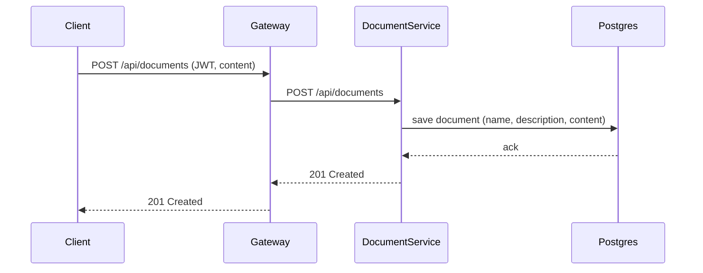
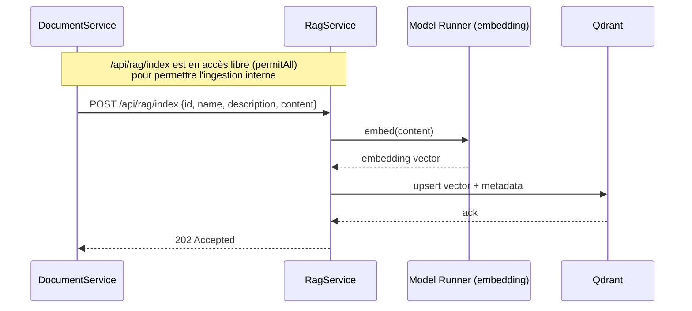
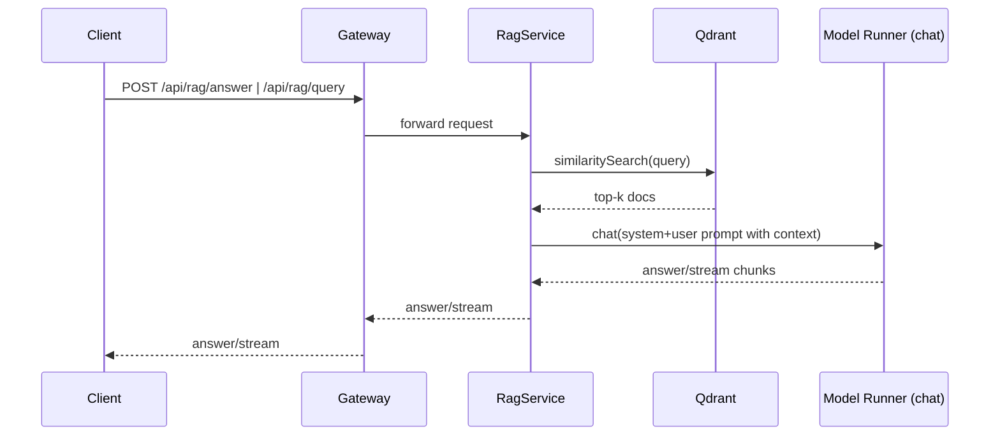
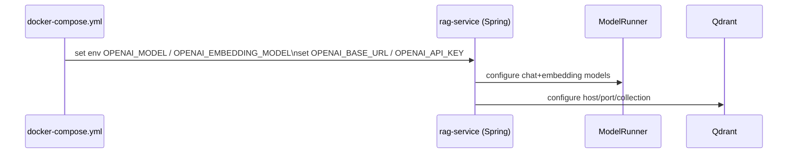

# Flux des appels RAG (document → indexation → question)

Ce fichier résume la séquence d’appels entre les services pour qu’un document soit ingéré dans Qdrant puis utilisé lors d’une question.

## 1. Upload du document
- **Client → Gateway → document-service** : `POST /api/documents` avec `{name, description, content}` et JWT.
- **document-service** : valide et persiste le document en base PostgreSQL, puis prépare la charge pour l’ingestion RAG (payload `{id, name, description, content}`).

## 2. Indexation (ingestion RAG)
- **document-service → rag-service** : `POST /api/rag/index` avec le payload d’ingestion.
- **rag-service** (`IngestionController.ingest`) : reçoit la requête, construit un `Document` Spring AI et l’ajoute au `VectorStore` (Qdrant).
- **Qdrant** : stocke les embeddings générés via le modèle d’embedding OpenAI-compatible (`spring.ai.openai.embedding.options.model`).

## 3. Question / RAG
- **Client → Gateway → rag-service** :
  - `POST /api/rag/answer` (réponse bloquante JSON) ou
  - `POST /api/rag/query` (SSE streaming).
- **rag-service** (`RagService.answer/streamAnswer`) :
  - Recherche de similarité dans Qdrant (`vectorStore.similaritySearch`).
  - Construction d’un prompt incluant le contexte trouvé.
- Appel LLM via `ChatClient` OpenAI (`spring.ai.openai.chat.options.model`).
- **Réponse** : le LLM répond en se basant sur le contexte injecté.

## 4. Points de configuration clés
- Modèle de chat : `spring.ai.openai.chat.options.model` (exposé en env `OPENAI_MODEL` dans `docker-compose.yml`).
- Modèle d’embedding : `spring.ai.openai.embedding.options.model` (exposé en env `OPENAI_EMBEDDING_MODEL`, par défaut même valeur que le modèle de chat).
- Endpoint/API key : `OPENAI_BASE_URL` / `OPENAI_API_KEY` pour pointer vers Docker Model Runner.
- Qdrant : `QDRANT_HOST/PORT/COLLECTION` dans `application.yml` ou variables d’env.

